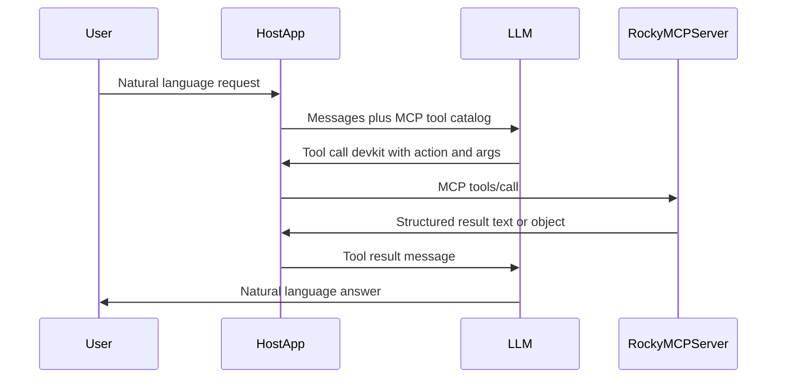

# Rocky — AI-assisted engineering workflow for teams and solo devs

**Repository:** [github.com/hellozheat/rocky](https://github.com/hellozheat/rocky)

Rocky is an MCP server for developers who care about code quality, not just code that runs. It provides an opinionated handbook for agentic-assisted programming (hexagonal React + agents/skills), one `devkit` gateway tool, codebase discovery (graphify + optional [Understand Anything](https://github.com/Lum1104/Understand-Anything)), and `pre_pr_quality_gate` before opening a PR.

**Public handbook server** — clients connect over HTTP (Cursor, Claude, or [mcp-use Inspector](https://mcp-use.com)).

## How it works with your AI (agentic-assisted)

Devkit does **not** replace your model. It provides an **agentic-assisted** playbook (agents + rules) so the model can:

- Write and refactor code in your repo (React, Next.js, API, Tailwind, libraries)
- Add or update tests (Vitest, Playwright, Storybook)
- Align architecture and run a **pre-PR quality gate**

The model should call `list_handbook`, read the right agent docs, **then edit your files** in the IDE. MCP actions (`repo_test`, `pre_pr_quality_gate`, etc.) support discovery and validation—they are not a substitute for implementation. You stay in control of scope and approvals.

Resource for models: `devkit://how-it-works`. Built-in prompt: `devkit-start-task`. Full value report (charts, phases, tokens): [below](#value-report--with-vs-without-mcp). Also: [docs/using-mcp-devkit-report.md](docs/using-mcp-devkit-report.md) · [Why agents & skills are split](docs/why-agents-and-skills-are-split.md).

### Example prompt (copy-paste)

Paste this into chat after MCP is connected. Replace the bracketed parts with your goal and paths.

```
Use Rocky: read devkit://how-it-works, list_handbook, and react-hexagonal (and vitest-writer / playwright-writer if tests are needed). Rewrite [specific path or feature] in this repo to match the handbook—edit files directly in the workspace. Use devkit for change_scope_analyzer, repo_test, and pre_pr_quality_gate before we're done. Do not only call MCP tools without changing files.
```

Scope one feature or folder at a time—not “rewrite the entire repo” in a single message.

## Contents

- [Features](#features)
- [Value report — with vs without MCP](#value-report--with-vs-without-mcp)
- [Who it's for](#who-its-for)
- [How it works with your AI](#how-it-works-with-your-ai-agentic-assisted)
- [Connect Rocky to Cursor/Claude](#connect-rocky-to-cursorclaude)
- [Deploy](#deploy)
- [Development](#development)
- [Senior workflow](#senior-workflow)
- [Codebase discovery](#codebase-discovery)
- [Tool model (gateway + standalone tools)](#tool-model-gateway--standalone-tools)
- [Reference: `devkit` actions](#reference-devkit-actions)
- [Handbook agents](#handbook-agents)
- [How to use it](#how-to-use-it)
- [When you need to do something extra](#when-you-need-to-do-something-extra)
- [MCP resources (read-only)](#mcp-resources-read-only)
- [MCP prompts](#mcp-prompts)
- [How the LLM uses MCP (what happens under the hood)](#how-the-llm-uses-mcp-what-happens-under-the-hood)
- [Learn more](#learn-more)
- [License](#license)

## Features

Built for teams and solo devs using AI assistants who want **reviewable PRs** instead of “AI slop” rejections.

- **Lower token usage and lower operating cost**
  - A single gateway tool (`devkit`) handles many actions through one schema.
  - Fewer repetitive tool descriptions in the host’s tool catalog.
  - Result: more useful context per request at the same token budget.
- **Pre-PR quality gate (Rocky differentiator)**
  - `pre_pr_quality_gate` runs lint, tests, and review heuristics before `repo_open_pr`.
  - Verdict `ready` / `not_ready` with blockers and warnings.
  - Result: fewer review rounds lost to style, lint, or missing tests.
- **Codebase discovery without blind grep**
  - **graphify** — cheap AST map (`graphify-out/GRAPH_REPORT.md`); refresh with `graphify update .` after edits.
  - **Understand Anything** (optional) — semantic knowledge graph when the user has run `/understand` locally; agents read `.understand-anything/knowledge-graph.json`, never auto-run the LLM pipeline from MCP.
  - Unified policy: handbook agent `codebase-discovery.md` and rule `codebase-discovery.mdc`.
- **Defense-in-depth for filesystem and command execution**
  - Path-scoped controls via `DEVKIT_ALLOWED_REPO_ROOTS`.
  - `safe_run` allowlists: `git`, `node`, `yarn`, `pnpm`, `tsc`, `eslint`, `graphify`.
  - Result: reduced risk of unsafe command execution and directory traversal.
- **Operational visibility and release support**
  - Repo actions: status, diff, blame, owners, lint, test, search, PR creation.
  - Web/repo analysis: release notes, incident signals, API drift, route health, perf hints, test gaps.
- **Developer advisory intelligence**
  - `dependency_advisor` — risky `package.json` version specs.
  - `change_scope_analyzer` — targeted checks/tests for a changed file.
- **Standardized agent behavior**
  - Team rules and agent playbooks under `src/mcp/rules` and `src/mcp/agents` as MCP resources (`devkit://handbook/...`).
  - Result: consistent React, Storybook, Vitest, Playwright, and review guidance across contributors.

## Who it's for

Teams and solo devs using **Cursor**, **Claude**, or any MCP host who want assistants to follow shared conventions and **pass review** before opening a PR.

## Connect Rocky to Cursor/Claude

After you deploy (see [Deploy](#deploy)), point your MCP client at the **public HTTPS URL** of this server (your `MCP_URL` in production).

**Cursor** — `~/.cursor/mcp.json` (replace with your deployed URL; exact shape depends on your host’s transport — SSE/streamable HTTP per [mcp-use deploy](https://mcp-use.com)):

```json
{
  "mcpServers": {
    "rocky": {
      "url": "https://your-rocky-host.example.com/mcp"
    }
  }
}
```

Restart the editor after changing MCP config. In chat, ask naturally (“list the handbook”, “run the pre-PR gate on …”); the model calls Rocky's `devkit` tool on your hosted server.

**Inspector:** open `https://your-rocky-host.example.com/inspector` to try tools manually.

**Repo paths:** hosted Rocky does **not** read your laptop’s disk unless you configure the deployment with explicit roots and access. Most teams use Rocky for the **handbook + gate guidance** in the client, and run lint/test in CI or locally. See [Install & security](docs/INSTALL.md).

## Deploy

```bash
yarn install
yarn build
yarn deploy
```

Set production env on the host (never commit `.env`):


| Variable                    | Purpose                                                                 |
| --------------------------- | ----------------------------------------------------------------------- |
| `MCP_URL`                   | Public base URL clients use (e.g. `https://rocky.example.com`)          |
| `PORT`                      | Listen port on the host                                                 |
| `DEVKIT_ALLOWED_REPO_ROOTS` | If repo tools run on the server, comma-separated allowed git roots only |
| `GITHUB_TOKEN`              | Only if the server should call `repo_open_pr` on your behalf            |


Copy from [`config/env.example`](config/env.example). For a **public handbook-only** deployment, omit `GITHUB_TOKEN` and tight path allowlists so the server cannot touch private repos.

**No MCP login** on `/mcp` — public handbook and tools. Optional `GITHUB_TOKEN` is only for the GitHub PR API.

## Development

```bash
git clone https://github.com/hellozheat/rocky.git
cd rocky
yarn install
yarn dev
```

Open [http://localhost:3000/inspector](http://localhost:3000/inspector) (or your `PORT` / `MCP_URL`).

```bash
yarn test
yarn lint:fix
yarn build
```

## Senior workflow

End-to-end pipeline the handbook reinforces:

1. **Discover** — `list_handbook`, graphify / Understand Anything (see [Codebase discovery](#codebase-discovery)), `project_intelligence`.
2. **Match conventions** — rules + agent for your stack (`react-hexagonal`, `nextjs-developer`, …).
3. **Implement** — small, reviewable diffs; read neighbors first.
4. **Verify** — `yarn lint:fix`, `yarn test`, `yarn build` in the target repo.
5. **Gate** — `pre_pr_quality_gate` until `verdict: ready`.
6. **PR** — `repo_open_pr` (needs `GITHUB_TOKEN`).

Details: [docs/senior-workflow.md](docs/senior-workflow.md) and resource `devkit://senior-workflow`.

## Codebase discovery


| Tool                    | Cost                  | When                                                   | Output                                        |
| ----------------------- | --------------------- | ------------------------------------------------------ | --------------------------------------------- |
| **graphify**            | AST-only, no LLM      | After substantive edits; before architecture questions | `graphify-out/GRAPH_REPORT.md`, optional wiki |
| **Understand Anything** | User-run LLM pipeline | Onboarding, domains, tours (optional)                  | `.understand-anything/knowledge-graph.json`   |


**Precedence** (handbook `codebase-discovery.md`):

1. Read Understand Anything graph if present.
2. Else read graphify report if present.
3. Else walk one feature folder end-to-end.

Agents still run `graphify update .` after code changes. They do **not** auto-invoke `/understand` from MCP.

- graphify: `devkit://graphify-workflow`
- Understand Anything: `devkit://understand-anything-workflow`

## Tool model (gateway + standalone tools)

Devkit exposes:

- **Unified gateway:** `devkit` (pass `action`).
- **Standalone tools** for direct use in Inspector or debugging:
  - Handbook: `list-dev-handbook`, `refresh-dev-handbook`
  - Dev/path DX: `workspace-roots-status`, `normalize-workspace-path`, `user-confirm-step`
  - Dev analysis: `project-intelligence`, `safe-run`, `dependency-advisor`, `change-scope-analyzer`
  - Quality: `pre-pr-quality-gate` (same logic as gateway `pre_pr_quality_gate`)
  - Web/repo helpers from `register-web-hq-tools` and `register-repo-actions`

For automation and agent use, prefer `devkit` so one tool contract covers core actions.

## Reference: `devkit` actions

Every operation uses `action` plus action-specific fields. Source of truth: Zod schema in `[src/mcp/lib/register-devkit-gateway.ts](src/mcp/lib/register-devkit-gateway.ts)` and resource `devkit://capabilities`.


| `action`                   | What it does                                                                                                            |
| -------------------------- | ----------------------------------------------------------------------------------------------------------------------- |
| `list_handbook`            | List team rules and agent docs (JSON with resource URIs).                                                               |
| `refresh_handbook`         | Rescan `src/mcp/rules` and `src/mcp/agents` without restarting.                                                         |
| `project_intelligence`     | Scripts, `tsconfig`, dependency counts, package manager, git status (optional `projectRoot`, `structured`).             |
| `safe_run`                 | Run allowlisted command: `command`, optional `args`, `cwd`, `timeoutMs`.                                                |
| `dependency_advisor`       | Flag risky `package.json` version specs (optional `projectRoot`, `structured`).                                         |
| `change_scope_analyzer`    | Suggest checks/tests for a changed file (`targetPath`, optional `projectRoot`, `structured`).                           |
| `pre_pr_quality_gate`      | **Lint, test, heuristics → `ready` / `not_ready`** (`repoPath`, optional `baseRef`, `maxFiles`, `force`, `structured`). |
| `web_release_notes`        | Release-oriented commit summary (`repoPath`, optional `lookbackHours`, `maxCommits`).                                   |
| `web_incident_digest`      | Incident signals from recent changes (`repoPath`, optional `area`, `lookbackHours`).                                    |
| `web_owner_lookup`         | CODEOWNERS or git contributors for a path (`repoPath`, `targetPath`).                                                   |
| `test_gap_finder`          | Changed sources that may lack nearby tests (`repoPath`, optional `baseRef`, `maxFiles`).                                |
| `web_route_health`         | Route-related change risk (`repoPath`, optional `routePattern`, `lookbackHours`).                                       |
| `web_api_contract_watch`   | API/schema drift signals (`repoPath`, optional `baseRef`, `maxFindings`).                                               |
| `web_perf_regression_hint` | Perf-related change signals (`repoPath`, optional `lookbackHours`).                                                     |
| `repo_status`              | Branch and working tree summary (`repoPath`, optional `includeUntracked`).                                              |
| `repo_diff`                | Git diff (`repoPath`, optional `scope`, `baseRef`, `filePaths`, `contextLines`, `maxBytes`).                            |
| `repo_search`              | `git grep` text search (`repoPath`, `query`, optional `mode`, `glob`, `maxResults`).                                    |
| `repo_test`                | Runs `yarn test` in the repo (`repoPath`, optional `target`, `value`, `timeoutSec`, `fix`).                             |
| `repo_lint`                | Runs `yarn lint` / `yarn lint:fix` (`repoPath`, optional `paths`, `fix`, `timeoutSec`).                                 |
| `repo_blame`               | Blame for a line range (`repoPath`, `filePath`, `startLine`, optional `endLine`).                                       |
| `repo_find_owner`          | CODEOWNERS for a path (`repoPath`, `filePath`).                                                                         |
| `repo_open_pr`             | Open a GitHub PR (`repoPath`, `title`, optional `base`, `body`, `draft`, …) — requires `GITHUB_TOKEN`.                  |


**Before every PR:** run `pre_pr_quality_gate`; only call `repo_open_pr` when `verdict` is `ready`.

## Handbook agents

Registered under `devkit://handbook/agents/…` (also listed via `list_handbook`):


| Agent                                | Use when                                                   |
| ------------------------------------ | ---------------------------------------------------------- |
| `codebase-discovery.md`              | Unified graphify + Understand Anything policy              |
| `graphify-local-project.md`          | graphify refresh after edits                               |
| `graphify-codebase-understanding.md` | Deep graphify-only repo map                                |
| `understand-anything-onboarding.md`  | Semantic graph already exists in repo                      |
| `react-hexagonal.md`                 | Hexagonal React UI (domain / application / infrastructure) |
| `nextjs-developer.md`                | Next.js `app/` projects                                    |
| `node-api-developer.md`              | API / backend                                              |
| `tailwind-ui-developer.md`           | Tailwind UI                                                |
| `typescript-library-developer.md`    | Shared TS packages                                         |
| `storybook-writer.md`                | Storybook CSF stories                                      |
| `vitest-writer.md`                   | Unit / component tests                                     |
| `playwright-writer.md`               | E2E tests                                                  |
| `code-reviewer.md`                   | Review playbook                                            |
| `coverage-and-review-workflow.md`    | Coverage + review pipeline                                 |
| `pr-quality-gate.md`                 | Pre-PR gate usage                                          |


Rules live under `devkit://handbook/rules/…` (e.g. `codebase-discovery.mdc`, `react-components.mdc`, `pr-quality-gate.mdc`).

## How to use it

### In chat (Cursor, Claude Desktop, etc.)

You do **not** need to memorize `action` names. Ask in natural language (for example: “run the pre-PR gate on this repo”, “list the handbook”, “who owns `src/foo.ts`?”). The host sends your message to the model; the model calls `devkit` with the right `action` and arguments.

**Typical PR flow:**

1. Implement changes in the user’s git repo.
2. `devkit` → `{ "action": "pre_pr_quality_gate", "repoPath": "/path/to/repo" }`
3. Fix blockers; re-run until `verdict` is `ready`.
4. `devkit` → `{ "action": "repo_open_pr", "repoPath": "...", "title": "..." }`

### On the hosted Inspector

1. Open your deployment’s `/inspector` URL.
2. Call tool `devkit`:

```json
{
  "action": "pre_pr_quality_gate",
  "repoPath": "/absolute/path/to/your/repo"
}
```

`repoPath` must be a **git checkout** and, if `DEVKIT_ALLOWED_REPO_ROOTS` is set, under an allowed root.

## When you need to do something extra


| Situation                                  | What to do                                                                                            |
| ------------------------------------------ | ----------------------------------------------------------------------------------------------------- |
| **Repo tools reject `repoPath`**           | Set `DEVKIT_ALLOWED_REPO_ROOTS` (comma-separated roots); `repoPath` must resolve inside one of them.  |
| **Dev tools reject `projectRoot` / `cwd`** | Same allowlist for `project-intelligence`, `dependency-advisor`, `change-scope-analyzer`, `safe-run`. |
| **Handbook files not found**               | Set `DEVKIT_HANDBOOK_ROOT` to the directory that contains `src/mcp/rules` and `src/mcp/agents`.       |
| `safe_run` not allowlisted                 | Only: `git`, `node`, `yarn`, `pnpm`, `tsc`, `eslint`, `graphify`.                                     |
| `repo_test` / `repo_lint` fail             | Target repo must define `test`, `lint`, `lint:fix` Yarn scripts.                                      |
| `repo_open_pr` fails                       | Set `GITHUB_TOKEN` with rights to open PRs. Optional `GITHUB_API_URL` for Enterprise.                 |
| **graphify not found**                     | Install graphify CLI or skip; agents fall back to folder walkthrough.                                 |
| **Understand Anything**                    | User installs plugin and runs `/understand` locally; agents only read existing artifacts.             |
| **Semantic `repo_search`**                 | `mode: "semantic"` is not implemented; use `mode: "text"`.                                            |


Full install and security notes: [docs/INSTALL.md](docs/INSTALL.md).

## MCP resources (read-only)

Fetched as resources (not tools):


| URI                                                        | Purpose                                                  |
| ---------------------------------------------------------- | -------------------------------------------------------- |
| `devkit://capabilities`                                    | Markdown map of all `devkit` actions.                    |
| `devkit://path-scope-policy`                               | Path safety for dev tools (`DEVKIT_ALLOWED_REPO_ROOTS`). |
| `devkit://tool-composability`                              | Composing narrow tools and structured output.            |
| `devkit://senior-workflow`                                 | Discover → implement → gate → PR.                        |
| `devkit://graphify-workflow`                               | graphify onboarding.                                     |
| `devkit://understand-anything-workflow`                    | Understand Anything onboarding.                          |
| `devkit://pr-quality-rubric`                               | Why reviewers reject AI PRs.                             |
| `devkit://token-cost-breakdown`                            | Token and cost tradeoffs.                                |
| `docs://architecture-style`                                | Layering and code style.                                 |
| `config://settings`                                        | Small server config snapshot.                            |
| `devkit://handbook/rules/…` / `devkit://handbook/agents/…` | One resource per handbook file.                          |


## MCP prompts

Built-in prompts (primed context for the model):


| Prompt                   | Purpose                                                 |
| ------------------------ | ------------------------------------------------------- |
| `devkit-start-task`      | Prime a feature/bugfix with handbook + discovery hints. |
| `devkit-review-code`     | Code review with handbook rules.                        |
| `devkit-before-pr`       | Pre-PR gate checklist.                                  |
| `devkit-learn-the-stack` | Onboard to hexagonal React handbook conventions.        |


## How the LLM uses MCP (what happens under the hood)

The **user** talks to the **host**; the **host** talks to the **LLM**; the **LLM** may call `devkit` on this MCP server; results return until the model answers.




- **Connection:** HTTP to your deployed `MCP_URL` (or `yarn dev` when developing this repo).
- **Tool catalog:** Host exposes `devkit` with an `action` field (see `devkit://capabilities`).
- **Invocation:** Model emits tool call → server validates → handler runs (gate, repo, handbook, …).
- **Result:** Tool result content is added to the conversation; the model replies in natural language.

## Learn more

- [Install & security](docs/INSTALL.md)
- [Using Rocky (value report)](docs/using-mcp-devkit-report.md) — with vs without MCP, tokens, diary
- [Why agents & skills are split](docs/why-agents-and-skills-are-split.md) — handbook architecture
- [Token & cost breakdown](docs/token-cost-breakdown.md)
- [Architecture profiles](docs/architecture-profiles.md)
- [Senior workflow](docs/senior-workflow.md)
- [mcp-use docs](https://mcp-use.com/docs/typescript/getting-started/quickstart)

## License

MIT