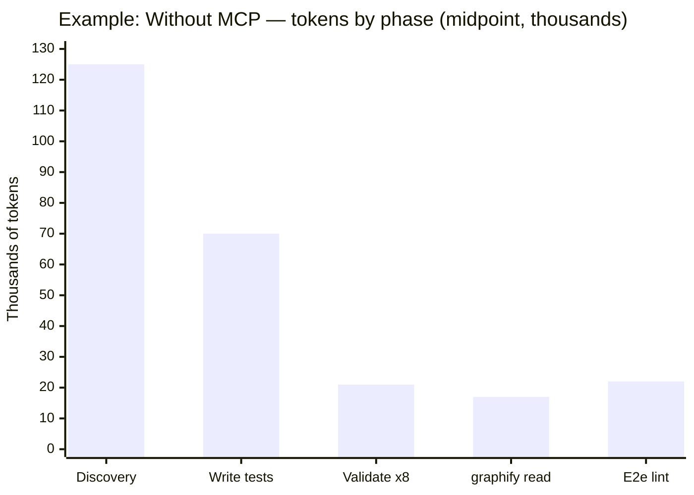
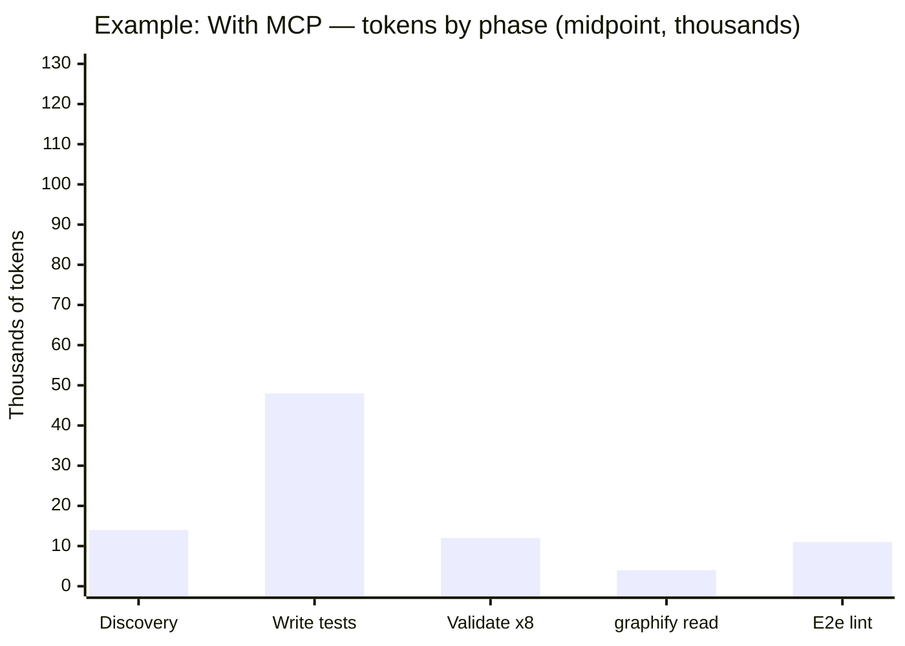
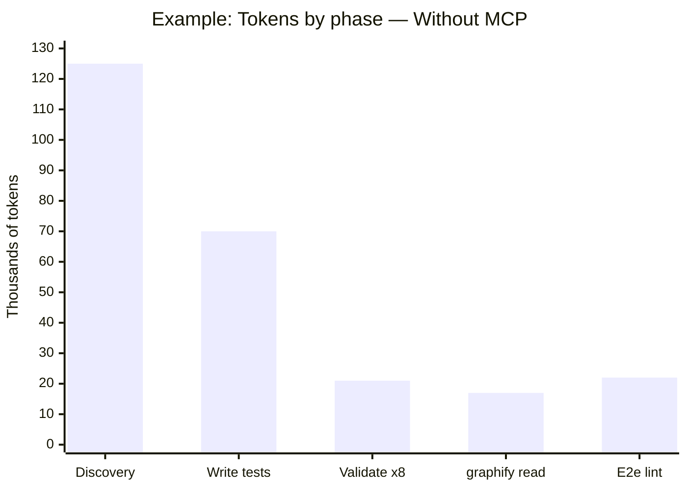
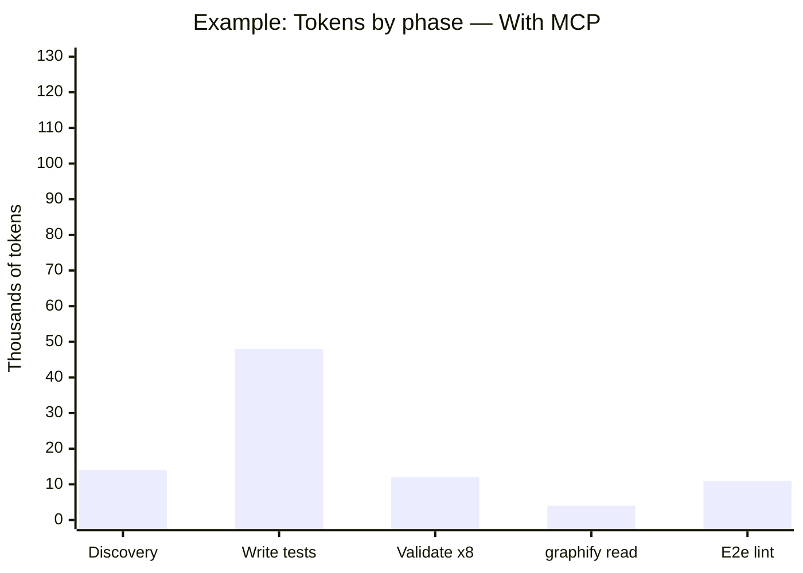
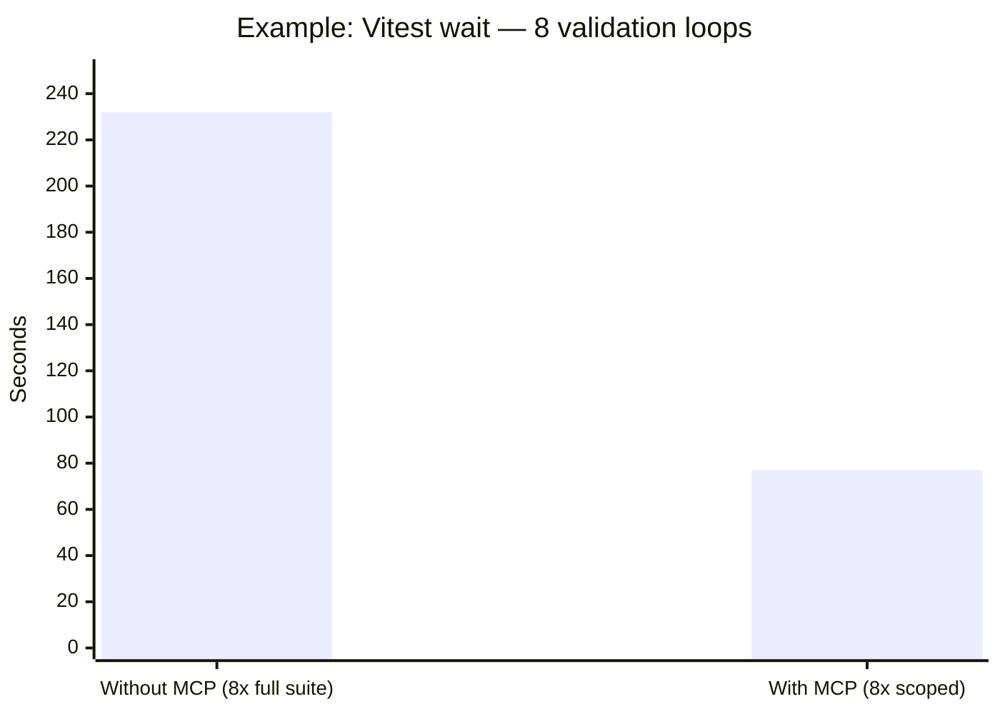
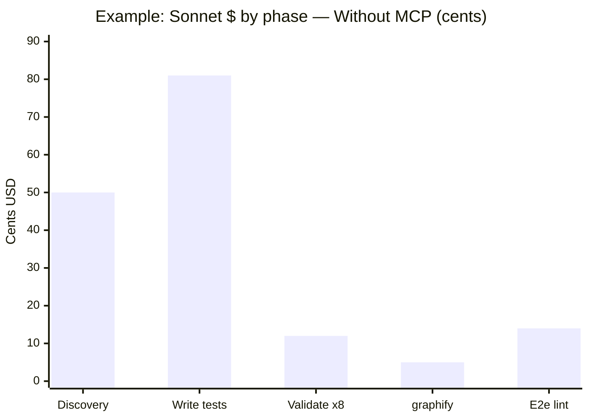
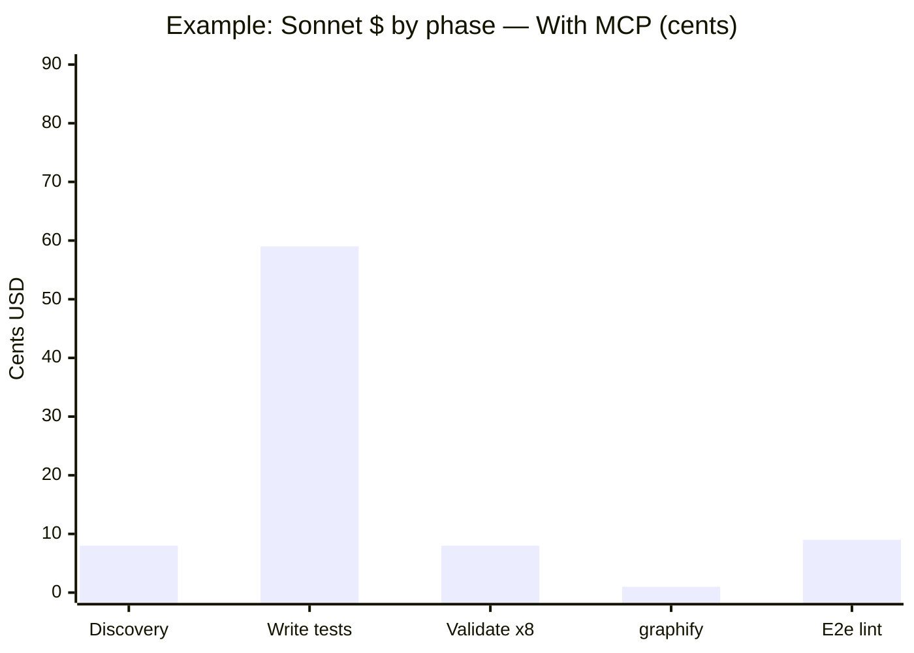

# Using Rocky — agentic-assisted programming value report

**Audience:** Engineers and leads using **Cursor / Claude** on real repos — solo or on a team.

**What this doc is:** Why connecting **Rocky** (handbook + `devkit` gateway) improves **agentic-assisted programming** vs “just the IDE” for the same kind of work: implement a feature, add tests, pass review, open a PR. You do **not** need a private team server — the public handbook and patterns apply to **your** repo.

| If you are… | Read this |
|-------------|-----------|
| **Everyone** | [Side-by-side comparison](#side-by-side-comparison-one-page) → [Measured example (charts)](#measured-example-same-mcp-workflow) → [AI agent diary](#what-it-was-like-from-the-ai-agent) |
| **Manager / lead** | Those two → [Plain English (2 min)](#plain-english-for-managers-2-minute-read) |
| **Engineer** | [How to work day to day](#how-to-work-day-to-day) → [Token breakdown](#token-breakdown-one-table) |
| **Handbook internals** | [Why agents and skills are split](./why-agents-and-skills-are-split.md) (separate doc) |

**Related:** [Token & cost breakdown](./token-cost-breakdown.md) · `devkit://how-it-works` · `devkit://capabilities`

---

## Side-by-side comparison (one page)

Same kind of **agentic-assisted** task everywhere: implement or fix something in the user’s repo (feature, tests, refactor), then get it review-ready.

| | **Without Rocky MCP** | **With Rocky MCP** |
|--|------------------------|---------------------|
| **What the AI can use** | Search, read files, terminal only | Same **plus** handbook (`devkit://handbook/…`) **plus** `devkit` actions |
| **Conventions** | Whatever the model guesses or old chat memory | Shared agents + rules (hexagonal React, tests, PR gate, …) |
| **Discovery** | Many greps + **10–20+ file reads** | `codebase-discovery` + graphify summary (not full report dump) |
| **What to test** | Manual hunt | `test_gap_finder` → short list of gaps |
| **Blast radius** | Guess from diff | `change_scope_analyzer` for a changed path |
| **Run tests** | Often **full suite** every time | `repo_test` / scoped commands when repo allows |
| **Lint feedback** | Paste long `yarn lint` output | `repo_lint` summary |
| **Before PR** | Hope CI catches issues | `pre_pr_quality_gate` → `ready` / `not_ready` |
| **Handbook tokens (disciplined)** | N/A (no handbook) | **~4k–6k** for how-it-works + discovery + 2 reads |
| **Typical session tokens (estimate)** | **~150k–300k** on a medium feature | **~70k–150k** (**~40–50% less**, directional) |
| **Solo dev without “the team”?** | You still need conventions somewhere | Connect hosted Rocky — **no org repo required** |
| **CI on merge** | Your pipeline | **Same** — MCP does not replace CI |

*Token ranges are **directional estimates** for a medium feature (implement + tests + one review pass). Log two comparable sessions in your org if finance needs proof.*

### Same five phases

| Phase | Without MCP | With Rocky MCP |
|-------|-------------|-----------------|
| **1. Discover** | Grep + read many files; easy to miss modules | `codebase-discovery` + graphify skim + optional `change_scope_analyzer` |
| **2. Implement** | You still write code in the editor | Same — MCP does not write for you |
| **3. Test** | Full suite or guess which files | `test_gap_finder` + targeted `repo_test` |
| **4. Lint / style** | Terminal spam in chat | `repo_lint` + handbook rules (`human-readable-code`, …) |
| **5. Before PR** | Subjective “looks fine” | `pre_pr_quality_gate` + `pr-quality-gate` agent |

---

## Measured example — same MCP workflow

*“That’s what we tested before.”* The numbers below come from a **real session** on a **large client project** (production React monorepo): add Vitest + Playwright for **table filters**, with vs without MCP connected. **Rocky** exposes the same gateway pattern (`test_gap_finder`, `change_scope_analyzer`, `repo_test`, `repo_lint`, …).

| Chart / table | Link |
|---------------|------|
| Tokens by phase — **without** MCP | [Without MCP](#without-mcp-token-breakdown-by-phase-example) |
| Tokens by phase — **with** MCP | [With MCP](#with-mcp-token-breakdown-by-phase-example) |
| **Side-by-side** (same scale) | [Compare phases](#side-by-side-tokens-by-phase-same-scale) |
| Vitest wait — **8 loops** | [Time chart](#vitest-wait-time-8-validation-loops-example) |
| Sonnet $ by phase | [Cost charts](#sonnet-cost-by-phase-example) |

### What we were building (the test)

| | |
|--|--|
| **Task** | Expand automated tests for table filters / status tracking |
| **Repo** | Large client app (data tables, reducers, e2e specs; **321** unit tests in full suite) |
| **Typical day** | Discover → write tests → **validate ×8** → lint → optional e2e |

### Executive numbers (measured + estimated)

| Metric | Without MCP | With MCP | Notes |
|--------|-------------|----------|-------|
| Vitest per check | **~29 s** (321 tests) | **~10 s** (3 scoped files) | **Measured** |
| Vitest × 8 loops | **~232 s** (~3.9 min) | **~77 s** (~1.3 min) | Calculated from measured single runs |
| Tokens / feature | **~150k–330k** | **~70k–170k** | **~40–55% lower** (estimated) |
| Discovery file reads | **~10–18** files | **~0–3** + tool JSON | |
| OpenRouter Sonnet 4.6 / feature | **~$1.62** | **~$0.85** | Same model; fewer tokens |

### Same five phases — what happened in that run

| Phase | Without MCP (that session) | With MCP (same task) |
|-------|---------------------------|----------------------|
| **1. Discover** | Semantic search + **10–18 file reads** | `test_gap_finder` + `change_scope_analyzer` + few files |
| **2. Build / write tests** | Edit Vitest + Playwright specs | Same editor work |
| **3. Validate (×8)** | `yarn test:run` every fix (**~29 s** each) | `repo_test` scoped (**~10 s** each) |
| **4. graphify** | CLI ~4 s; costly if full `GRAPH_REPORT.md` in chat | CLI + **summary only** |
| **5. E2e + lint** | Long terminal logs in thread | `repo_lint` + shorter logs |

---

### Without MCP — token breakdown by phase (example)

| Phase | Input tokens | Output tokens | Subtotal |
|-------|--------------|---------------|----------|
| Discovery (search + reads) | **80k – 150k** | **5k – 15k** | **85k – 165k** |
| Writing tests | **10k – 30k** | **35k – 65k** | **45k – 95k** |
| Validation loops (×8) | **8k – 24k** | **2k – 8k** | **10k – 32k** |
| graphify report (if full read) | **15k – 17k** | — | **15k – 17k** |
| E2e + lint logs | **5k – 25k** | **3k – 10k** | **8k – 35k** |
| **Total range** | **~118k – 246k** | **~45k – 98k** | **~150k – 330k** |

*Midpoint bars → **~255k** total. Discovery dominated because the agent read the repo instead of tool JSON.*

---

### With MCP — token breakdown by phase (example)

| Phase | Input tokens | Output tokens | Subtotal |
|-------|--------------|---------------|----------|
| Discovery (tools + few files) | **5k – 15k** | **2k – 5k** | **7k – 20k** |
| Writing tests | **5k – 15k** | **25k – 50k** | **30k – 65k** |
| Validation loops (×8, scoped) | **4k – 12k** | **2k – 6k** | **6k – 18k** |
| graphify (summary only) | **3k – 5k** | — | **3k – 5k** |
| E2e + lint | **3k – 10k** | **2k – 6k** | **5k – 16k** |
| **Total range** | **~20k – 57k** | **~31k – 67k** | **~70k – 170k** |

*Midpoint bars → **~89k** total (within the 70k–170k band).*

---

### Side-by-side — tokens by phase (same scale)

| Phase | Without MCP (thousands) | With MCP (thousands) | Reduction |
|-------|-------------------------|----------------------|-----------|
| Discovery | 125 | 14 | **~89%** |
| Write tests | 70 | 48 | **~31%** |
| Validate ×8 | 21 | 12 | **~43%** |
| graphify read | 17 | 4 | **~76%** |
| E2e / lint | 22 | 11 | **~50%** |
| **Total (midpoint)** | **~255k** | **~89k** | **~65%** |

**Same Y-axis (0–130k)** — compare the two charts phase by phase:

*Discovery **125 vs 14** is the story: briefing vs walking every room.*

---

### Vitest wait time — 8 validation loops (example)

| Activity | Measured? | Duration |
|----------|-----------|----------|
| `yarn test:run` (once) | **Yes** | **~29 s** |
| × **8** loops (without MCP path) | Calculated | **~232 s** |
| Scoped vitest (once) | **Yes** | **~10 s** |
| × **8** loops (with MCP path) | Calculated | **~77 s** |
| `graphify update .` | **Yes** | **~4 s** (CLI; not token cost) |

---

### Sonnet 4.6 cost by phase (example — feeds token table above)

OpenRouter list rates (May 2026): **$3/M input**, **$15/M output** on [claude-sonnet-4.6](https://openrouter.ai/anthropic/claude-sonnet-4.6).

| Phase | Without MCP (in / out) | Without $ | With MCP (in / out) | With MCP $ |
|-------|------------------------|-----------|---------------------|------------|
| Discovery | ~115k / ~10k | **~$0.50** | ~10k / ~4k | **~$0.08** |
| Write tests | ~20k / ~50k | **~$0.81** | ~10k / ~38k | **~$0.59** |
| Validate ×8 | ~16k / ~5k | **~$0.12** | ~8k / ~4k | **~$0.08** |
| graphify read | ~17k / — | **~$0.05** | ~4k / — | **~$0.01** |
| E2e + lint | ~15k / ~7k | **~$0.14** | ~7k / ~4k | **~$0.09** |
| **Total** | **~183k / ~72k** | **~$1.62** | **~39k / ~49k** | **~$0.85** |

*Source: measured on that large client project; charts above are from that run.*

---

## What it was like (from the AI agent)

*First-person — working on a **user’s repo** with vs without Rocky connected.*

### The task

You ask me to **add tests**, **fix a feature**, or **refactor** so it matches how your team wants code to look in review. I still edit files in the workspace. The difference is whether I have the **handbook** and **gateway** in my tool list.

**Important:** MCP in `~/.cursor/mcp.json` is not the same as **connected and green** in Cursor. Config ≠ connected.

### Without Rocky MCP — how it felt

| Moment | What I did | How it felt |
|--------|------------|-------------|
| **Start** | Semantic search + grep across the repo | Walking the whole building for one door |
| **Conventions** | Infer from random files | Inconsistent with last session unless you paste rules every time |
| **graphify** | `graphify update .` is fine CLI-side | Painful if I paste **all** of `GRAPH_REPORT.md` into chat |
| **Tests** | `yarn test` / full suite repeatedly | Reliable but **slow**; burns wait time and context on logs |
| **Review prep** | Re-read diff + hope | No structured `ready` / `not_ready` |
| **Solo dev** | You are the “team” | Every project reinvents prompts |

**Summary:** I can finish. It is **slower**, **noisier**, and **more expensive in tokens**. I worry I missed a file that should have been tested or a convention your reviewer cares about.

### With Rocky MCP — how it felt

| Moment | What I did | How it felt |
|--------|------------|-------------|
| **Start** | `devkit-start-task` or README flow → router → **2–3** handbook reads | Briefing, not a library |
| **Discover** | `codebase-discovery` + graphify policy | Map when needed, not a novel every turn |
| **Implement** | Same editor work | Handbook sets **how** (hexagonal, tests, styling) |
| **Validate** | `repo_test`, `repo_lint`, scoped vitest | Smaller feedback loops |
| **Gaps** | `test_gap_finder` | Obvious missing tests without reading every folder |
| **Before PR** | `pre_pr_quality_gate` | Clear blockers vs warnings |
| **Solo dev** | Hosted public Rocky | **Team playbook without a team server** |

**Summary:** Same outcome, **less thrashing**. I spend context on **your code**, not reinventing process. That is the product value — not “another agent file format.”

### What I would tell your manager

| Question | Answer |
|----------|--------|
| Does MCP change the **app** or CI? | **No** — same code merge path. |
| Does MCP change **how the AI works**? | **Yes** — shared conventions, targeted checks, less context waste. |
| Do you need a **team deployment**? | **No** for the handbook — connect public Rocky; repo tools need path access to **your** clone. |
| Best one-liner | *Same model, **~40–50% fewer tokens** on a typical feature when Rocky is connected and the model follows the router (estimate).* |

### What I would tell engineers

1. Connect **devkit** in Cursor; confirm it is **green**.  
2. Start with **`devkit-start-task`** or the [README example](../README.md#example-prompt-copy-paste).  
3. Read **`codebase-discovery`** once per repo; pick **one router row** — do not read every agent in `list_handbook`.  
4. Use **`repo_test`** / scoped tests, not full suite every message.  
5. Run **`pre_pr_quality_gate`** before `repo_open_pr`.

---

## Plain English for managers (2-minute read)

### The problem

Developers use AI to ship code faster. Without shared tooling, each session **re-discovers** the repo, **re-guesses** standards, and **re-runs** huge test/lint cycles. That burns **time** and **AI usage** (tokens), and review still catches style issues late.

### The solution in one sentence

**Rocky** gives the AI a **team-grade handbook** and **small, safe repo actions** (test gaps, lint summary, pre-PR gate) — even for a **solo** developer using a public server.

### What you should expect (directional)

| | Without MCP | With Rocky MCP |
|--|-------------|-----------------|
| AI context on process | Ad hoc | Shared playbook |
| Test/lint feedback | Heavy logs | Targeted actions |
| Review surprises | More common | `pre_pr_quality_gate` first |
| Tokens per feature | Higher band (~150k–300k) | Lower band (~70k–150k) |

For **dollar** proof, use your org’s Cursor/OpenRouter dashboard on two comparable tickets — we do not hard-code pricing here because plans change.

---

## How to work day to day

1. **`devkit` → `list_handbook`** only when you need a URI you do not know.  
2. **`devkit://how-it-works`** — contract: handbook + implement in files + gateway for validation.  
3. **Router** in `devkit-start-task` — React → `react-hexagonal`; tests → `vitest-writer`; API → `nestjs-hexagonal` / `fastapi-hexagonal` / `node-api-developer`.  
4. **Skills** — load when you need templates (e.g. `vitest-react`), not by default.  
5. **graphify** — run in terminal; read summary sections, not the full wiki in chat.

---

## Token breakdown (one table)

Single place for context economics — not separate OpenRouter, Cursor, and handbook spreadsheets.

| Bucket | Without MCP (typical) | With Rocky MCP (typical) |
|--------|------------------------|---------------------------|
| Repo discovery (reads + grep) | **~40k–80k** | **~15k–30k** |
| Handbook / process | **0** (ad hoc prompts) | **~4k–6k** (disciplined) |
| Test + lint logs in chat | **~30k–60k** | **~10k–25k** |
| Implementation turns | **~80k–160k** | **~40k–90k** |
| **Session total (mid)** | **~150k–300k** | **~70k–150k** |

**Ways Rocky saves tokens**

- **Router** — read 2–3 handbook files, not 24 agents.  
- **Gateway** — structured JSON from `test_gap_finder`, `change_scope_analyzer`, `repo_lint` vs pasting terminals.  
- **Scoped tests** — less log volume (see [measured example](#measured-example-same-mcp-workflow)).  
- **graphify policy** — summary-first, not full report in thread.

**Ways Rocky does *not* save tokens**

- Calling `list_handbook` and then reading **every** agent body.  
- Ignoring the router and loading all skills.  
- Pasting `graphify-out/` wholesale into chat.

---

## Solo dev vs team

| Myth | Reality |
|------|---------|
| “Rocky is only for our org’s private server.” | Public handbook works for **any** repo you open in Cursor. |
| “I need the team’s repo checked in.” | Handbook is **server-side**; your code stays local. |
| “Without a team I don’t need conventions.” | Solo devs benefit **more** — you are your own reviewer. |

Repo-scoped actions (`repo_test`, `pre_pr_quality_gate`) need `DEVKIT_ALLOWED_REPO_ROOTS` (or local stdio) pointing at **your** clone — that is path config, not team membership.

---

## References

- [Why agents and skills are split](./why-agents-and-skills-are-split.md)
- [Token & cost breakdown](./token-cost-breakdown.md)
- [How devkit works with LLMs](../src/mcp/docs/how-devkit-works-with-llms.md)
- Measured example (charts): [this doc](#measured-example-same-mcp-workflow)
